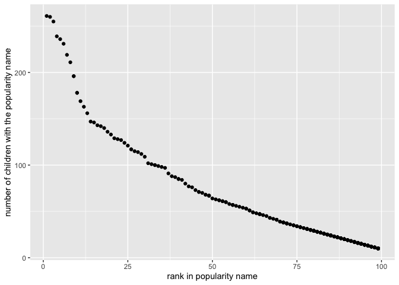

p8105\_hw2\_fs2757
================
FEI SUN
2021/10/5

``` r
library(tidyverse)
```

    ## ── Attaching packages ─────────────────────────────────────── tidyverse 1.3.1 ──

    ## ✓ ggplot2 3.3.5     ✓ purrr   0.3.4
    ## ✓ tibble  3.1.4     ✓ dplyr   1.0.7
    ## ✓ tidyr   1.1.3     ✓ stringr 1.4.0
    ## ✓ readr   2.0.1     ✓ forcats 0.5.1

    ## ── Conflicts ────────────────────────────────────────── tidyverse_conflicts() ──
    ## x dplyr::filter() masks stats::filter()
    ## x dplyr::lag()    masks stats::lag()

``` r
library(readxl)
library(dplyr)
```

## Problem 1

First I read and clean the Mr. Trash Wheel sheet, and I use reasonable
variable names for this data. Furthermore, I omit rows that do not
include dumpster-specific data and round the number of sports balls to
the nearest integer.

``` r
TrashWheel_data = read_excel("/Users/sunfei/Desktop/Trash-Wheel-Collection-Totals-7-2020-2.xlsx",sheet = "Mr. Trash Wheel",range = "A2:N534")
TrashWheel_data = 
  janitor::clean_names(TrashWheel_data) %>% 
  drop_na(dumpster)%>% 
  mutate(sports_balls = round(sports_balls,digits = 0))   
skimr::skim(TrashWheel_data)
```

|                                                  |                  |
|:-------------------------------------------------|:-----------------|
| Name                                             | TrashWheel\_data |
| Number of rows                                   | 453              |
| Number of columns                                | 14               |
| \_\_\_\_\_\_\_\_\_\_\_\_\_\_\_\_\_\_\_\_\_\_\_   |                  |
| Column type frequency:                           |                  |
| character                                        | 1                |
| numeric                                          | 12               |
| POSIXct                                          | 1                |
| \_\_\_\_\_\_\_\_\_\_\_\_\_\_\_\_\_\_\_\_\_\_\_\_ |                  |
| Group variables                                  | None             |

Data summary

**Variable type: character**

| skim\_variable | n\_missing | complete\_rate | min | max | empty | n\_unique | whitespace |
|:---------------|-----------:|---------------:|----:|----:|------:|----------:|-----------:|
| month          |          0 |              1 |   3 |   9 |     0 |        13 |          0 |

**Variable type: numeric**

| skim\_variable       | n\_missing | complete\_rate |     mean |       sd |      p0 |     p25 |      p50 |      p75 |      p100 | hist  |
|:---------------------|-----------:|---------------:|---------:|---------:|--------:|--------:|---------:|---------:|----------:|:------|
| dumpster             |          0 |              1 |   227.00 |   130.91 |    1.00 |  114.00 |   227.00 |   340.00 |    453.00 | ▇▇▇▇▇ |
| year                 |          0 |              1 |  2017.26 |     1.95 | 2014.00 | 2015.00 |  2018.00 |  2019.00 |   2021.00 | ▆▃▇▃▃ |
| weight\_tons         |          0 |              1 |     3.20 |     0.73 |    0.78 |    2.72 |     3.19 |     3.68 |      5.62 | ▁▃▇▃▁ |
| volume\_cubic\_yards |          0 |              1 |    15.41 |     1.48 |    7.00 |   15.00 |    15.00 |    15.00 |     20.00 | ▁▁▁▇▂ |
| plastic\_bottles     |          0 |              1 |  1898.93 |  1027.78 |  210.00 |  980.00 |  1850.00 |  2640.00 |   5960.00 | ▇▇▅▁▁ |
| polystyrene          |          0 |              1 |  1920.92 |  1161.89 |  210.00 |  950.00 |  1650.00 |  2730.00 |   6540.00 | ▇▅▃▁▁ |
| cigarette\_butts     |          0 |              1 | 24521.68 | 32047.72 |  980.00 | 5000.00 | 11000.00 | 32000.00 | 310000.00 | ▇▁▁▁▁ |
| glass\_bottles       |          0 |              1 |    22.45 |    17.44 |    0.00 |    9.00 |    18.00 |    32.00 |    110.00 | ▇▃▂▁▁ |
| grocery\_bags        |          0 |              1 |  1103.82 |   860.26 |   50.00 |  425.00 |   820.00 |  1620.00 |   3750.00 | ▇▅▂▂▁ |
| chip\_bags           |          0 |              1 |  1558.40 |   946.59 |  180.00 |  800.00 |  1327.00 |  2150.00 |   5085.00 | ▇▆▃▁▁ |
| sports\_balls        |          0 |              1 |    11.75 |     9.18 |    0.00 |    5.00 |     9.00 |    16.00 |     56.00 | ▇▃▁▁▁ |
| homes\_powered       |          0 |              1 |    45.32 |    21.71 |    0.00 |   38.83 |    51.17 |    58.67 |     93.67 | ▃▂▇▅▁ |

**Variable type: POSIXct**

| skim\_variable | n\_missing | complete\_rate | min        | max        | median     | n\_unique |
|:---------------|-----------:|---------------:|:-----------|:-----------|:-----------|----------:|
| date           |          0 |              1 | 1900-01-20 | 2021-01-04 | 2018-02-05 |       275 |

Read and clean precipitation data for 2018 and 2019. For each, omit rows
without precipitation data and add a variable for year. Next, combine
precipitation datasets and convert month to a character variable (the
variable month.name is built into R and should be useful).

``` r
precipitation_2019 = 
  read_excel("/Users/sunfei/Desktop/Trash-Wheel-Collection-Totals-7-2020-2.xlsx",sheet = "2019 Precipitation",skip = 1, range = "A2:B14")%>%
  janitor::clean_names()%>%
  mutate(year= "2019")%>%
  drop_na()

precipitation_2018 = 
  read_excel("/Users/sunfei/Desktop/Trash-Wheel-Collection-Totals-7-2020-2.xlsx",sheet = "2018 Precipitation",skip = 1, range = "A2:B14")%>%
  janitor::clean_names()%>%
  mutate(year= "2018")%>%
  drop_na()

precipitation20182019 = 
  bind_rows(precipitation_2019, precipitation_2018) %>%
  janitor::clean_names()%>%
  mutate(month = month.name[month]) 
```

For dataset `TrashWheel_data`, in the code Table: Data summary

|                                                  |                  |
|:-------------------------------------------------|:-----------------|
| Name                                             | TrashWheel\_data |
| Number of rows                                   | 453              |
| Number of columns                                | 14               |
| \_\_\_\_\_\_\_\_\_\_\_\_\_\_\_\_\_\_\_\_\_\_\_   |                  |
| Column type frequency:                           |                  |
| character                                        | 1                |
| numeric                                          | 12               |
| POSIXct                                          | 1                |
| \_\_\_\_\_\_\_\_\_\_\_\_\_\_\_\_\_\_\_\_\_\_\_\_ |                  |
| Group variables                                  | None             |

**Variable type: character**

| skim\_variable | n\_missing | complete\_rate | min | max | empty | n\_unique | whitespace |
|:---------------|-----------:|---------------:|----:|----:|------:|----------:|-----------:|
| month          |          0 |              1 |   3 |   9 |     0 |        13 |          0 |

**Variable type: numeric**

| skim\_variable       | n\_missing | complete\_rate |     mean |       sd |      p0 |     p25 |      p50 |      p75 |      p100 | hist  |
|:---------------------|-----------:|---------------:|---------:|---------:|--------:|--------:|---------:|---------:|----------:|:------|
| dumpster             |          0 |              1 |   227.00 |   130.91 |    1.00 |  114.00 |   227.00 |   340.00 |    453.00 | ▇▇▇▇▇ |
| year                 |          0 |              1 |  2017.26 |     1.95 | 2014.00 | 2015.00 |  2018.00 |  2019.00 |   2021.00 | ▆▃▇▃▃ |
| weight\_tons         |          0 |              1 |     3.20 |     0.73 |    0.78 |    2.72 |     3.19 |     3.68 |      5.62 | ▁▃▇▃▁ |
| volume\_cubic\_yards |          0 |              1 |    15.41 |     1.48 |    7.00 |   15.00 |    15.00 |    15.00 |     20.00 | ▁▁▁▇▂ |
| plastic\_bottles     |          0 |              1 |  1898.93 |  1027.78 |  210.00 |  980.00 |  1850.00 |  2640.00 |   5960.00 | ▇▇▅▁▁ |
| polystyrene          |          0 |              1 |  1920.92 |  1161.89 |  210.00 |  950.00 |  1650.00 |  2730.00 |   6540.00 | ▇▅▃▁▁ |
| cigarette\_butts     |          0 |              1 | 24521.68 | 32047.72 |  980.00 | 5000.00 | 11000.00 | 32000.00 | 310000.00 | ▇▁▁▁▁ |
| glass\_bottles       |          0 |              1 |    22.45 |    17.44 |    0.00 |    9.00 |    18.00 |    32.00 |    110.00 | ▇▃▂▁▁ |
| grocery\_bags        |          0 |              1 |  1103.82 |   860.26 |   50.00 |  425.00 |   820.00 |  1620.00 |   3750.00 | ▇▅▂▂▁ |
| chip\_bags           |          0 |              1 |  1558.40 |   946.59 |  180.00 |  800.00 |  1327.00 |  2150.00 |   5085.00 | ▇▆▃▁▁ |
| sports\_balls        |          0 |              1 |    11.75 |     9.18 |    0.00 |    5.00 |     9.00 |    16.00 |     56.00 | ▇▃▁▁▁ |
| homes\_powered       |          0 |              1 |    45.32 |    21.71 |    0.00 |   38.83 |    51.17 |    58.67 |     93.67 | ▃▂▇▅▁ |

**Variable type: POSIXct**

| skim\_variable | n\_missing | complete\_rate | min        | max        | median     | n\_unique |
|:---------------|-----------:|---------------:|:-----------|:-----------|:-----------|----------:|
| date           |          0 |              1 | 1900-01-20 | 2021-01-04 | 2018-02-05 |       275 |

, we could know that the summary information about the dataset. There
are 14 observations, 453 rows and 14 columns. By coding dumpster, month,
year, date, weight\_tons, volume\_cubic\_yards, plastic\_bottles,
polystyrene, cigarette\_butts, glass\_bottles, grocery\_bags,
chip\_bags, sports\_balls, homes\_powered, we could know that 14
different variable names.

For dataset `precipitation_2019`, in the code Table: Data summary

|                                                  |                     |
|:-------------------------------------------------|:--------------------|
| Name                                             | precipitation\_2019 |
| Number of rows                                   | 12                  |
| Number of columns                                | 3                   |
| \_\_\_\_\_\_\_\_\_\_\_\_\_\_\_\_\_\_\_\_\_\_\_   |                     |
| Column type frequency:                           |                     |
| character                                        | 1                   |
| numeric                                          | 2                   |
| \_\_\_\_\_\_\_\_\_\_\_\_\_\_\_\_\_\_\_\_\_\_\_\_ |                     |
| Group variables                                  | None                |

**Variable type: character**

| skim\_variable | n\_missing | complete\_rate | min | max | empty | n\_unique | whitespace |
|:---------------|-----------:|---------------:|----:|----:|------:|----------:|-----------:|
| year           |          0 |              1 |   4 |   4 |     0 |         1 |          0 |

**Variable type: numeric**

| skim\_variable | n\_missing | complete\_rate | mean |   sd |   p0 |  p25 |  p50 |  p75 |  p100 | hist  |
|:---------------|-----------:|---------------:|-----:|-----:|-----:|-----:|-----:|-----:|------:|:------|
| month          |          0 |              1 | 6.50 | 3.61 | 1.00 | 3.75 | 6.50 | 9.25 | 12.00 | ▇▅▅▅▇ |
| total          |          0 |              1 | 2.83 | 1.61 | 0.16 | 1.76 | 3.34 | 3.69 |  5.45 | ▃▃▃▇▃ |

, we also could know that the summary information. There are 3
observations, 12 rows and 3 columns. By coding month, total, year, we
could know that 3 different variable names.

For dataset `precipitation_2018`, in the code Table: Data summary

|                                                  |                     |
|:-------------------------------------------------|:--------------------|
| Name                                             | precipitation\_2018 |
| Number of rows                                   | 12                  |
| Number of columns                                | 3                   |
| \_\_\_\_\_\_\_\_\_\_\_\_\_\_\_\_\_\_\_\_\_\_\_   |                     |
| Column type frequency:                           |                     |
| character                                        | 1                   |
| numeric                                          | 2                   |
| \_\_\_\_\_\_\_\_\_\_\_\_\_\_\_\_\_\_\_\_\_\_\_\_ |                     |
| Group variables                                  | None                |

**Variable type: character**

| skim\_variable | n\_missing | complete\_rate | min | max | empty | n\_unique | whitespace |
|:---------------|-----------:|---------------:|----:|----:|------:|----------:|-----------:|
| year           |          0 |              1 |   4 |   4 |     0 |         1 |          0 |

**Variable type: numeric**

| skim\_variable | n\_missing | complete\_rate | mean |   sd |   p0 |  p25 |  p50 |  p75 |  p100 | hist  |
|:---------------|-----------:|---------------:|-----:|-----:|-----:|-----:|-----:|-----:|------:|:------|
| month          |          0 |              1 | 6.50 | 3.61 | 1.00 | 3.75 | 6.50 | 9.25 | 12.00 | ▇▅▅▅▇ |
| total          |          0 |              1 | 5.86 | 3.13 | 0.94 | 4.19 | 5.46 | 8.18 | 10.47 | ▆▂▇▂▆ |

, we also could know that the summary information. There are 3
observations, 12 rows and 3 columns. By coding month, total, year, we
could know that 3 different variable names.

For dataset `precipitation20182019`, in the code Table: Data summary

|                                                  |                       |
|:-------------------------------------------------|:----------------------|
| Name                                             | precipitation20182019 |
| Number of rows                                   | 24                    |
| Number of columns                                | 3                     |
| \_\_\_\_\_\_\_\_\_\_\_\_\_\_\_\_\_\_\_\_\_\_\_   |                       |
| Column type frequency:                           |                       |
| character                                        | 2                     |
| numeric                                          | 1                     |
| \_\_\_\_\_\_\_\_\_\_\_\_\_\_\_\_\_\_\_\_\_\_\_\_ |                       |
| Group variables                                  | None                  |

**Variable type: character**

| skim\_variable | n\_missing | complete\_rate | min | max | empty | n\_unique | whitespace |
|:---------------|-----------:|---------------:|----:|----:|------:|----------:|-----------:|
| month          |          0 |              1 |   3 |   9 |     0 |        12 |          0 |
| year           |          0 |              1 |   4 |   4 |     0 |         2 |          0 |

**Variable type: numeric**

| skim\_variable | n\_missing | complete\_rate | mean |   sd |   p0 |  p25 |  p50 |  p75 |  p100 | hist  |
|:---------------|-----------:|---------------:|-----:|-----:|-----:|-----:|-----:|-----:|------:|:------|
| total          |          0 |              1 | 4.34 | 2.88 | 0.16 | 2.32 | 3.74 | 5.62 | 10.47 | ▇▇▇▂▃ |

, we also could know that the summary information. There are 3
observations, 24 rows and 3 columns. By coding month, total, year, we
could know that 3 different variable names.

The total precipitation in 2018 is 70.33, and the median number of
sports balls in a dumpster in 2019 is 9.

## Problem 2

``` r
pols_month=read_csv("/Users/sunfei/Desktop/pols-month.csv") %>%
  janitor::clean_names() %>%
  separate(mon,into = c("year","month","day"))%>%
  mutate(month = month.name[as.numeric(month)],day = as.numeric(day),year = as.numeric(year))%>%
  mutate(president = ifelse(prez_dem == 0, "gop", "dem"))%>%
  select(-"day", -"prez_gop", -"prez_dem") 
```

    ## Rows: 822 Columns: 9

    ## ── Column specification ────────────────────────────────────────────────────────
    ## Delimiter: ","
    ## dbl  (8): prez_gop, gov_gop, sen_gop, rep_gop, prez_dem, gov_dem, sen_dem, r...
    ## date (1): mon

    ## 
    ## ℹ Use `spec()` to retrieve the full column specification for this data.
    ## ℹ Specify the column types or set `show_col_types = FALSE` to quiet this message.

``` r
snp=read_csv("/Users/sunfei/Desktop/snp.csv")%>%
  janitor::clean_names()%>%
  mutate(date = lubridate::mdy(date)) %>% 
  separate(date, into = c("year", "month", "day")) %>% 
  mutate(month = month.name[as.numeric(month)],day = as.numeric(day),year = as.numeric(year)) %>% 
  select(-"day") 
```

    ## Rows: 787 Columns: 2

    ## ── Column specification ────────────────────────────────────────────────────────
    ## Delimiter: ","
    ## chr (1): date
    ## dbl (1): close

    ## 
    ## ℹ Use `spec()` to retrieve the full column specification for this data.
    ## ℹ Specify the column types or set `show_col_types = FALSE` to quiet this message.

``` r
unemployment=read_csv("/Users/sunfei/Desktop/unemployment.csv")%>%
  pivot_longer(Jan:Dec, names_to = "month", values_to = "unemployment")%>% 
  janitor::clean_names()%>%
  mutate(year = as.numeric(year))
```

    ## Rows: 68 Columns: 13

    ## ── Column specification ────────────────────────────────────────────────────────
    ## Delimiter: ","
    ## dbl (13): Year, Jan, Feb, Mar, Apr, May, Jun, Jul, Aug, Sep, Oct, Nov, Dec

    ## 
    ## ℹ Use `spec()` to retrieve the full column specification for this data.
    ## ℹ Specify the column types or set `show_col_types = FALSE` to quiet this message.

``` r
mergeddata_1=left_join(pols_month, snp, by = c("year", "month")) 
mergeddata_2=left_join(unemployment,mergeddata_1, by = c("year", "month"))
```

The datasets `pols_month` has 822 rows and 9 columns. By coding year,
month, gov\_gop, sen\_gop, rep\_gop, gov\_dem, sen\_dem, rep\_dem,
president, we could know that 9 different variable names. Also I could
get the range of years by coding 1947, 2015.

The datasets `snp` has 787 rows and 3 columns. By coding year, month,
close, we could know that 3 different variable names. Also I could get
the range of years by coding 1969, 2068.

The datasets `unemployment` has 816 rows and 3 columns. By coding year,
month, unemployment, we could know that 3 different variable names. Also
I could get the range of years by coding 1948, 2015.

The datasets `mergeddata_2` has 816 rows and 11 columns. By coding year,
month, unemployment, gov\_gop, sen\_gop, rep\_gop, gov\_dem, sen\_dem,
rep\_dem, president, close, we could know that 11 different variable
names. Also I could get the range of years by coding 1948, 2015.

## Problem 3

``` r
# cleaning the data/converting the uppercase letters about name and gender to lowercase string/converting ambiguous ethnicity word to the official one.
PopularBabyNames=read_csv("/Users/sunfei/Desktop/Popular_Baby_Names.csv")%>%
  janitor::clean_names()%>%
  mutate(childs_first_name = tolower(childs_first_name),ethnicity = as.factor(ethnicity),gender = tolower(gender))%>%
  mutate(ethnicity = recode(ethnicity, `ASIAN AND PACI` = "ASIAN AND PACIFIC ISLANDER", `BLACK NON HISP ` = "BLACK NON HISPANIC", `WHITE NON HISP` = "WHITE NON HISPANIC"))
```

    ## Rows: 19418 Columns: 6

    ## ── Column specification ────────────────────────────────────────────────────────
    ## Delimiter: ","
    ## chr (3): Gender, Ethnicity, Child's First Name
    ## dbl (3): Year of Birth, Count, Rank

    ## 
    ## ℹ Use `spec()` to retrieve the full column specification for this data.
    ## ℹ Specify the column types or set `show_col_types = FALSE` to quiet this message.

``` r
# removing the duplicated rows 
PopularBabyNames = PopularBabyNames[!duplicated(PopularBabyNames),]

# showing and doing a clear and reader-friendly table about the rank in popularity of the name “Olivia” as a female name 
olivia = PopularBabyNames %>% 
  filter(childs_first_name == "olivia") %>% 
  pivot_wider(names_from = "year_of_birth", values_from = "count")
  knitr::kable(olivia)
```

| gender | ethnicity                  | childs\_first\_name | rank | 2016 | 2015 | 2014 | 2013 | 2012 | 2011 |
|:-------|:---------------------------|:--------------------|-----:|-----:|-----:|-----:|-----:|-----:|-----:|
| female | ASIAN AND PACIFIC ISLANDER | olivia              |    1 |  172 |  188 |  141 |   NA |   NA |   NA |
| female | BLACK NON HISPANIC         | olivia              |    8 |   49 |   NA |   52 |   NA |   NA |   NA |
| female | HISPANIC                   | olivia              |   13 |  108 |   NA |   NA |   NA |   NA |   NA |
| female | WHITE NON HISPANIC         | olivia              |    1 |  230 |  225 |  248 |  233 |   NA |   NA |
| female | BLACK NON HISPANIC         | olivia              |    4 |   NA |   82 |   NA |   NA |   NA |   NA |
| female | HISPANIC                   | olivia              |   16 |   NA |   94 |   96 |   NA |   NA |   NA |
| female | ASIAN AND PACIFIC ISLANDER | olivia              |    3 |   NA |   NA |   NA |  109 |  132 |   NA |
| female | BLACK NON HISPANIC         | olivia              |    6 |   NA |   NA |   NA |   64 |   NA |   NA |
| female | HISPANIC                   | olivia              |   22 |   NA |   NA |   NA |   87 |   77 |   NA |
| female | BLACK NON HISP             | olivia              |    8 |   NA |   NA |   NA |   NA |   58 |   NA |
| female | WHITE NON HISPANIC         | olivia              |    4 |   NA |   NA |   NA |   NA |  198 |   NA |
| female | ASIAN AND PACIFIC ISLANDER | olivia              |    4 |   NA |   NA |   NA |   NA |   NA |   89 |
| female | BLACK NON HISPANIC         | olivia              |   10 |   NA |   NA |   NA |   NA |   NA |   52 |
| female | HISPANIC                   | olivia              |   18 |   NA |   NA |   NA |   NA |   NA |   86 |
| female | WHITE NON HISPANIC         | olivia              |    2 |   NA |   NA |   NA |   NA |   NA |  213 |

``` r
# showing and doing a clear and reader-friendly table about the rank in popularity of the male name
popularmalename=PopularBabyNames %>% 
  filter(gender == "male", rank == "1") %>% 
  pivot_wider(names_from = "year_of_birth", values_from = "count")
  knitr::kable(popularmalename)
```

| gender | ethnicity                  | childs\_first\_name | rank | 2016 | 2015 | 2014 | 2013 | 2012 | 2011 |
|:-------|:---------------------------|:--------------------|-----:|-----:|-----:|-----:|-----:|-----:|-----:|
| male   | ASIAN AND PACIFIC ISLANDER | ethan               |    1 |  193 |   NA |   NA |   NA |   NA |  177 |
| male   | BLACK NON HISPANIC         | noah                |    1 |  148 |  163 |   NA |   NA |   NA |   NA |
| male   | HISPANIC                   | liam                |    1 |  387 |  356 |  312 |   NA |   NA |   NA |
| male   | WHITE NON HISPANIC         | joseph              |    1 |  261 |   NA |  300 |   NA |  300 |   NA |
| male   | ASIAN AND PACIFIC ISLANDER | jayden              |    1 |   NA |  190 |  187 |  220 |   NA |   NA |
| male   | WHITE NON HISPANIC         | david               |    1 |   NA |  299 |   NA |  304 |   NA |   NA |
| male   | BLACK NON HISPANIC         | ethan               |    1 |   NA |   NA |  138 |  146 |   NA |   NA |
| male   | HISPANIC                   | jayden              |    1 |   NA |   NA |   NA |  352 |  364 |  426 |
| male   | ASIAN AND PACIFIC ISLANDER | ryan                |    1 |   NA |   NA |   NA |   NA |  197 |   NA |
| male   | BLACK NON HISP             | jayden              |    1 |   NA |   NA |   NA |   NA |  171 |   NA |
| male   | BLACK NON HISPANIC         | jayden              |    1 |   NA |   NA |   NA |   NA |   NA |  184 |
| male   | WHITE NON HISPANIC         | michael             |    1 |   NA |   NA |   NA |   NA |   NA |  292 |

``` r
# showing a graph about the name and the rank in popularity of white non-hispanic make children born in 2016
malewhitenonhispanicin2016=PopularBabyNames %>% 
  filter(gender == "male", year_of_birth=="2016",ethnicity=="WHITE NON HISPANIC")  

ggplot(malewhitenonhispanicin2016, aes(x = rank, y = count)) + geom_point()+ylab("number of children with the popularity name") + xlab("rank in popularity name")
```

<!-- -->
