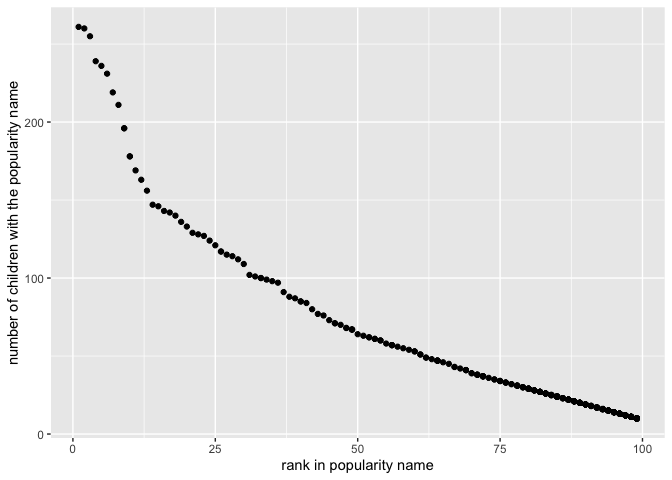

p8105\_hw2\_fs2757
================
FEI SUN
2021/10/5

``` r
library(tidyverse)
library(readxl)
library(dplyr)
```

# Problem 1

``` r
# cleaning the dataset/using reasonable variable names/omitting rows/rounding the number of sports balls to the nearest integer
TrashWheel_data = read_excel("/Users/sunfei/Desktop/Trash-Wheel-Collection-Totals-7-2020-2.xlsx",sheet = "Mr. Trash Wheel",range = "A2:N535")
TrashWheel_data = 
  janitor::clean_names(TrashWheel_data) %>% 
  drop_na(dumpster)%>% 
  mutate(sports_balls = round(sports_balls,digits = 0))   

skimr::skim(TrashWheel_data)
```

|                                                  |                  |
|:-------------------------------------------------|:-----------------|
| Name                                             | TrashWheel\_data |
| Number of rows                                   | 454              |
| Number of columns                                | 14               |
| \_\_\_\_\_\_\_\_\_\_\_\_\_\_\_\_\_\_\_\_\_\_\_   |                  |
| Column type frequency:                           |                  |
| character                                        | 2                |
| numeric                                          | 11               |
| POSIXct                                          | 1                |
| \_\_\_\_\_\_\_\_\_\_\_\_\_\_\_\_\_\_\_\_\_\_\_\_ |                  |
| Group variables                                  | None             |

Data summary

**Variable type: character**

| skim\_variable | n\_missing | complete\_rate | min | max | empty | n\_unique | whitespace |
|:---------------|-----------:|---------------:|----:|----:|------:|----------:|-----------:|
| dumpster       |          0 |              1 |   1 |  11 |     0 |       454 |          0 |
| month          |          1 |              1 |   3 |   9 |     0 |        13 |          0 |

**Variable type: numeric**

| skim\_variable       | n\_missing | complete\_rate |     mean |        sd |      p0 |     p25 |      p50 |      p75 |       p100 | hist  |
|:---------------------|-----------:|---------------:|---------:|----------:|--------:|--------:|---------:|---------:|-----------:|:------|
| year                 |          1 |              1 |  2017.26 |      1.95 | 2014.00 | 2015.00 |  2018.00 |  2019.00 |     2021.0 | ▆▃▇▃▃ |
| weight\_tons         |          0 |              1 |     6.39 |     67.89 |    0.78 |    2.72 |     3.19 |     3.68 |     1449.7 | ▇▁▁▁▁ |
| volume\_cubic\_yards |          0 |              1 |    30.76 |    326.96 |    7.00 |   15.00 |    15.00 |    15.00 |     6982.0 | ▇▁▁▁▁ |
| plastic\_bottles     |          0 |              1 |  3789.49 |  40295.85 |  210.00 |  980.00 |  1850.00 |  2640.00 |   860215.0 | ▇▁▁▁▁ |
| polystyrene          |          0 |              1 |  3833.38 |  40765.80 |  210.00 |  950.00 |  1650.00 |  2730.00 |   870177.0 | ▇▁▁▁▁ |
| cigarette\_butts     |          0 |              1 | 48935.33 | 521172.52 |  980.00 | 5000.00 | 11000.00 | 32750.00 | 11108320.0 | ▇▁▁▁▁ |
| glass\_bottles       |          0 |              1 |    44.81 |    476.61 |    0.00 |    9.25 |    18.00 |    32.00 |    10171.0 | ▇▁▁▁▁ |
| grocery\_bags        |          0 |              1 |  2201.50 |  23404.23 |   50.00 |  426.25 |   820.00 |  1627.50 |   499448.0 | ▇▁▁▁▁ |
| chip\_bags           |          0 |              1 |  3107.37 |  33017.93 |  180.00 |  802.50 |  1333.50 |  2150.00 |   704792.0 | ▇▁▁▁▁ |
| sports\_balls        |          0 |              1 |    23.43 |    249.06 |    0.00 |    5.00 |     9.00 |    16.00 |     5315.0 | ▇▁▁▁▁ |
| homes\_powered       |          0 |              1 |    90.44 |    961.64 |    0.00 |   38.88 |    51.17 |    58.79 |    20530.0 | ▇▁▁▁▁ |

**Variable type: POSIXct**

| skim\_variable | n\_missing | complete\_rate | min        | max        | median     | n\_unique |
|:---------------|-----------:|---------------:|:-----------|:-----------|:-----------|----------:|
| date           |          1 |              1 | 1900-01-20 | 2021-01-04 | 2018-02-05 |       275 |

``` r
#Reading and cleaning precipitation data for each 2018 and 2019/ combining the two precipitation datasets/converting month to a character variable
precipitation_2019 = 
  read_excel("/Users/sunfei/Desktop/Trash-Wheel-Collection-Totals-7-2020-2.xlsx",sheet = "2019 Precipitation",skip = 1, range = "A2:B14")%>%
  janitor::clean_names()%>%
  mutate(year= "2019",month = month.name[month])
precipitation_2019
```

    ## # A tibble: 12 × 3
    ##    month     total year 
    ##    <chr>     <dbl> <chr>
    ##  1 January    3.1  2019 
    ##  2 February   3.64 2019 
    ##  3 March      4.47 2019 
    ##  4 April      1.46 2019 
    ##  5 May        3.58 2019 
    ##  6 June       0.42 2019 
    ##  7 July       3.85 2019 
    ##  8 August     2.39 2019 
    ##  9 September  0.16 2019 
    ## 10 October    5.45 2019 
    ## 11 November   1.86 2019 
    ## 12 December   3.57 2019

``` r
precipitation_2018 = 
  read_excel("/Users/sunfei/Desktop/Trash-Wheel-Collection-Totals-7-2020-2.xlsx",sheet = "2018 Precipitation",skip = 1, range = "A2:B14")%>%
  janitor::clean_names()%>%
  mutate(year= "2018",month = month.name[month])
precipitation_2018
```

    ## # A tibble: 12 × 3
    ##    month     total year 
    ##    <chr>     <dbl> <chr>
    ##  1 January    0.94 2018 
    ##  2 February   4.8  2018 
    ##  3 March      2.69 2018 
    ##  4 April      4.69 2018 
    ##  5 May        9.27 2018 
    ##  6 June       4.77 2018 
    ##  7 July      10.2  2018 
    ##  8 August     6.45 2018 
    ##  9 September 10.5  2018 
    ## 10 October    2.12 2018 
    ## 11 November   7.82 2018 
    ## 12 December   6.11 2018

``` r
precipitation20182019 = 
  bind_rows(precipitation_2019, precipitation_2018) %>%
  janitor::clean_names()

precipitation20182019
```

    ## # A tibble: 24 × 3
    ##    month     total year 
    ##    <chr>     <dbl> <chr>
    ##  1 January    3.1  2019 
    ##  2 February   3.64 2019 
    ##  3 March      4.47 2019 
    ##  4 April      1.46 2019 
    ##  5 May        3.58 2019 
    ##  6 June       0.42 2019 
    ##  7 July       3.85 2019 
    ##  8 August     2.39 2019 
    ##  9 September  0.16 2019 
    ## 10 October    5.45 2019 
    ## # … with 14 more rows

For dataset `TrashWheel_data`, in the code
`skimr::skim(TrashWheel_data)`, we could know that the summary
information about the dataset. There are 14 observations,
`nrow(TrashWheel_data)` rows and `ncol(TrashWheel_data)` columns. By
coding `names(TrashWheel_data)`, we could know that 14 different
variable names.

For dataset `precipitation_2019`, in the code
`skimr::skim(precipitation_2019)`, we also could know that the summary
information. There are `length(precipitation_2019)` observations,
`nrow(precipitation_2019)` rows and `ncol(precipitation_2019)` columns.
By coding `names(precipitation_2019)`, we could know that 3 different
variable names.

For dataset `precipitation_2018`, in the code
`skimr::skim(precipitation_2018)`, we also could know that the summary
information. There are `length(precipitation_2018)` observations,
`nrow(precipitation_2018)` rows and `ncol(precipitation_2018)` columns.
By coding `names(precipitation_2018)`, we could know that 3 different
variable names.

For dataset `precipitation20182019`, in the code
`skimr::skim(precipitation20182019)`, we also could know that the
summary information. There are `length(precipitation20182019)`
observations, `nrow(precipitation20182019)` rows and
`ncol(precipitation20182019)` columns. By coding
`names(precipitation20182019)`, we could know that 3 different variable
names.

The total precipitation in 2018 is
`sum(pull(precipitation_2018, total))`, and the median number of sports
balls in a dumpster in 2019 is
`median(pull(filter(TrashWheel_data, year == 2019),sports_balls))`.

# Problem 2

``` r
# cleaning the dataset/separating some whole variable to some integer variables(yyyy/mm/dd)/replacing the month number with month name/removing some variable
pols_month=read_csv("/Users/sunfei/Desktop/pols-month.csv") %>%
  janitor::clean_names() %>%
  separate(mon,into = c("year","month","day"))%>%
  mutate(month = month.name[as.numeric(month)],day = as.numeric(day),year = as.numeric(year))%>%
  mutate(president = ifelse(prez_dem == 0, "gop", "dem"))%>%
  select(-"day", -"prez_gop", -"prez_dem")
```

    ## Rows: 822 Columns: 9

    ## ── Column specification ────────────────────────────────────────────────────────
    ## Delimiter: ","
    ## dbl  (8): prez_gop, gov_gop, sen_gop, rep_gop, prez_dem, gov_dem, sen_dem, r...
    ## date (1): mon

    ## 
    ## ℹ Use `spec()` to retrieve the full column specification for this data.
    ## ℹ Specify the column types or set `show_col_types = FALSE` to quiet this message.

``` r
pols_month
```

    ## # A tibble: 822 × 9
    ##     year month     gov_gop sen_gop rep_gop gov_dem sen_dem rep_dem president
    ##    <dbl> <chr>       <dbl>   <dbl>   <dbl>   <dbl>   <dbl>   <dbl> <chr>    
    ##  1  1947 January        23      51     253      23      45     198 dem      
    ##  2  1947 February       23      51     253      23      45     198 dem      
    ##  3  1947 March          23      51     253      23      45     198 dem      
    ##  4  1947 April          23      51     253      23      45     198 dem      
    ##  5  1947 May            23      51     253      23      45     198 dem      
    ##  6  1947 June           23      51     253      23      45     198 dem      
    ##  7  1947 July           23      51     253      23      45     198 dem      
    ##  8  1947 August         23      51     253      23      45     198 dem      
    ##  9  1947 September      23      51     253      23      45     198 dem      
    ## 10  1947 October        23      51     253      23      45     198 dem      
    ## # … with 812 more rows

``` r
# cleaning and organizing the dataset
snp=read_csv("/Users/sunfei/Desktop/snp.csv")%>%
  janitor::clean_names()%>%
  mutate(date = lubridate::mdy(date)) %>% 
  separate(date, into = c("year", "month", "day")) %>% 
  mutate(month = month.name[as.numeric(month)],day = as.numeric(day),year = as.numeric(year)) %>% 
  select(-"day") 
```

    ## Rows: 787 Columns: 2

    ## ── Column specification ────────────────────────────────────────────────────────
    ## Delimiter: ","
    ## chr (1): date
    ## dbl (1): close

    ## 
    ## ℹ Use `spec()` to retrieve the full column specification for this data.
    ## ℹ Specify the column types or set `show_col_types = FALSE` to quiet this message.

``` r
snp
```

    ## # A tibble: 787 × 3
    ##     year month    close
    ##    <dbl> <chr>    <dbl>
    ##  1  2015 July     2080.
    ##  2  2015 June     2063.
    ##  3  2015 May      2107.
    ##  4  2015 April    2086.
    ##  5  2015 March    2068.
    ##  6  2015 February 2104.
    ##  7  2015 January  1995.
    ##  8  2014 December 2059.
    ##  9  2014 November 2068.
    ## 10  2014 October  2018.
    ## # … with 777 more rows

``` r
# switching the dataset form and merging to the previous dataset
unemployment=read_csv("/Users/sunfei/Desktop/unemployment.csv")%>%
  pivot_longer(Jan:Dec, names_to = "month", values_to = "unemployment")%>% 
  janitor::clean_names()%>%
  mutate(year = as.numeric(year))
```

    ## Rows: 68 Columns: 13

    ## ── Column specification ────────────────────────────────────────────────────────
    ## Delimiter: ","
    ## dbl (13): Year, Jan, Feb, Mar, Apr, May, Jun, Jul, Aug, Sep, Oct, Nov, Dec

    ## 
    ## ℹ Use `spec()` to retrieve the full column specification for this data.
    ## ℹ Specify the column types or set `show_col_types = FALSE` to quiet this message.

``` r
unemployment
```

    ## # A tibble: 816 × 3
    ##     year month unemployment
    ##    <dbl> <chr>        <dbl>
    ##  1  1948 Jan            3.4
    ##  2  1948 Feb            3.8
    ##  3  1948 Mar            4  
    ##  4  1948 Apr            3.9
    ##  5  1948 May            3.5
    ##  6  1948 Jun            3.6
    ##  7  1948 Jul            3.6
    ##  8  1948 Aug            3.9
    ##  9  1948 Sep            3.8
    ## 10  1948 Oct            3.7
    ## # … with 806 more rows

``` r
#merging all dataset
mergeddata_1=left_join(pols_month, snp, by = c("year", "month")) 
mergeddata_2=left_join(unemployment,mergeddata_1, by = c("year", "month"))
mergeddata_2
```

    ## # A tibble: 816 × 11
    ##     year month unemployment gov_gop sen_gop rep_gop gov_dem sen_dem rep_dem
    ##    <dbl> <chr>        <dbl>   <dbl>   <dbl>   <dbl>   <dbl>   <dbl>   <dbl>
    ##  1  1948 Jan            3.4      NA      NA      NA      NA      NA      NA
    ##  2  1948 Feb            3.8      NA      NA      NA      NA      NA      NA
    ##  3  1948 Mar            4        NA      NA      NA      NA      NA      NA
    ##  4  1948 Apr            3.9      NA      NA      NA      NA      NA      NA
    ##  5  1948 May            3.5      22      53     253      24      48     198
    ##  6  1948 Jun            3.6      NA      NA      NA      NA      NA      NA
    ##  7  1948 Jul            3.6      NA      NA      NA      NA      NA      NA
    ##  8  1948 Aug            3.9      NA      NA      NA      NA      NA      NA
    ##  9  1948 Sep            3.8      NA      NA      NA      NA      NA      NA
    ## 10  1948 Oct            3.7      NA      NA      NA      NA      NA      NA
    ## # … with 806 more rows, and 2 more variables: president <chr>, close <dbl>

### briefly explain

The datasets `pols_month` has `nrow(pols_month)` rows and
`ncol(pols_month)` columns. By coding `names(pols_month)`, we could know
that 9 different variable names. Also I could get the range of years by
coding `range(pull(pols_month, year))`.

The datasets `snp` has `nrow(snp)` rows and `ncol(snp)` columns. By
coding `names(snp)`, we could know that 3 different variable names. Also
I could get the range of years by coding `range(pull(snp, year))`.

The datasets `unemployment` has `nrow(unemployment)` rows and
`ncol(unemployment)` columns. By coding `names(unemployment)`, we could
know that 3 different variable names. Also I could get the range of
years by coding `range(pull(unemployment, year))`.

The datasets `mergeddata_2` has `nrow(mergeddata_2)` rows and
`ncol(mergeddata_2)` columns. By coding `names(mergeddata_2)`, we could
know that 11 different variable names. Also I could get the range of
years by coding `range(pull(mergeddata_2, year))`.

# Problem 3

``` r
# cleaning the data/converting the uppercase letters about name and gender to lowercase string/converting ambiguous ethnicity word to the official one.
PopularBabyNames=read_csv("/Users/sunfei/Desktop/Popular_Baby_Names.csv")%>%
  janitor::clean_names()%>%
  mutate(childs_first_name = toupper(childs_first_name),ethnicity = as.factor(ethnicity),gender = toupper(gender))%>%
  mutate(ethnicity = recode(ethnicity, `ASIAN AND PACI` = "ASIAN AND PACIFIC ISLANDER", `BLACK NON HISP ` = "BLACK NON HISPANIC", `WHITE NON HISP` = "WHITE NON HISPANIC"))
```

    ## Rows: 19418 Columns: 6

    ## ── Column specification ────────────────────────────────────────────────────────
    ## Delimiter: ","
    ## chr (3): Gender, Ethnicity, Child's First Name
    ## dbl (3): Year of Birth, Count, Rank

    ## 
    ## ℹ Use `spec()` to retrieve the full column specification for this data.
    ## ℹ Specify the column types or set `show_col_types = FALSE` to quiet this message.

``` r
# removing the duplicated rows 
PopularBabyNames = PopularBabyNames[!duplicated(PopularBabyNames),]
PopularBabyNames
```

    ## # A tibble: 12,181 × 6
    ##    year_of_birth gender ethnicity                  childs_first_name count  rank
    ##            <dbl> <chr>  <fct>                      <chr>             <dbl> <dbl>
    ##  1          2016 FEMALE ASIAN AND PACIFIC ISLANDER OLIVIA              172     1
    ##  2          2016 FEMALE ASIAN AND PACIFIC ISLANDER CHLOE               112     2
    ##  3          2016 FEMALE ASIAN AND PACIFIC ISLANDER SOPHIA              104     3
    ##  4          2016 FEMALE ASIAN AND PACIFIC ISLANDER EMILY                99     4
    ##  5          2016 FEMALE ASIAN AND PACIFIC ISLANDER EMMA                 99     4
    ##  6          2016 FEMALE ASIAN AND PACIFIC ISLANDER MIA                  79     5
    ##  7          2016 FEMALE ASIAN AND PACIFIC ISLANDER CHARLOTTE            59     6
    ##  8          2016 FEMALE ASIAN AND PACIFIC ISLANDER SARAH                57     7
    ##  9          2016 FEMALE ASIAN AND PACIFIC ISLANDER ISABELLA             56     8
    ## 10          2016 FEMALE ASIAN AND PACIFIC ISLANDER HANNAH               56     8
    ## # … with 12,171 more rows

``` r
# showing and doing a clear and reader-friendly table about the rank in popularity of the name “Olivia” as a female name 
olivia = PopularBabyNames %>% 
  filter(childs_first_name == "OLIVIA") %>% 
  pivot_wider(names_from = "year_of_birth", values_from = "count")
  knitr::kable(olivia)
```

| gender | ethnicity                  | childs\_first\_name | rank | 2016 | 2015 | 2014 | 2013 | 2012 | 2011 |
|:-------|:---------------------------|:--------------------|-----:|-----:|-----:|-----:|-----:|-----:|-----:|
| FEMALE | ASIAN AND PACIFIC ISLANDER | OLIVIA              |    1 |  172 |  188 |  141 |   NA |   NA |   NA |
| FEMALE | BLACK NON HISPANIC         | OLIVIA              |    8 |   49 |   NA |   52 |   NA |   NA |   NA |
| FEMALE | HISPANIC                   | OLIVIA              |   13 |  108 |   NA |   NA |   NA |   NA |   NA |
| FEMALE | WHITE NON HISPANIC         | OLIVIA              |    1 |  230 |  225 |  248 |  233 |   NA |   NA |
| FEMALE | BLACK NON HISPANIC         | OLIVIA              |    4 |   NA |   82 |   NA |   NA |   NA |   NA |
| FEMALE | HISPANIC                   | OLIVIA              |   16 |   NA |   94 |   96 |   NA |   NA |   NA |
| FEMALE | ASIAN AND PACIFIC ISLANDER | OLIVIA              |    3 |   NA |   NA |   NA |  109 |  132 |   NA |
| FEMALE | BLACK NON HISPANIC         | OLIVIA              |    6 |   NA |   NA |   NA |   64 |   NA |   NA |
| FEMALE | HISPANIC                   | OLIVIA              |   22 |   NA |   NA |   NA |   87 |   77 |   NA |
| FEMALE | BLACK NON HISP             | OLIVIA              |    8 |   NA |   NA |   NA |   NA |   58 |   NA |
| FEMALE | WHITE NON HISPANIC         | OLIVIA              |    4 |   NA |   NA |   NA |   NA |  198 |   NA |
| FEMALE | ASIAN AND PACIFIC ISLANDER | OLIVIA              |    4 |   NA |   NA |   NA |   NA |   NA |   89 |
| FEMALE | BLACK NON HISPANIC         | OLIVIA              |   10 |   NA |   NA |   NA |   NA |   NA |   52 |
| FEMALE | HISPANIC                   | OLIVIA              |   18 |   NA |   NA |   NA |   NA |   NA |   86 |
| FEMALE | WHITE NON HISPANIC         | OLIVIA              |    2 |   NA |   NA |   NA |   NA |   NA |  213 |

``` r
olivia
```

    ## # A tibble: 15 × 10
    ##    gender ethnicity    childs_first_na…  rank `2016` `2015` `2014` `2013` `2012`
    ##    <chr>  <fct>        <chr>            <dbl>  <dbl>  <dbl>  <dbl>  <dbl>  <dbl>
    ##  1 FEMALE ASIAN AND P… OLIVIA               1    172    188    141     NA     NA
    ##  2 FEMALE BLACK NON H… OLIVIA               8     49     NA     52     NA     NA
    ##  3 FEMALE HISPANIC     OLIVIA              13    108     NA     NA     NA     NA
    ##  4 FEMALE WHITE NON H… OLIVIA               1    230    225    248    233     NA
    ##  5 FEMALE BLACK NON H… OLIVIA               4     NA     82     NA     NA     NA
    ##  6 FEMALE HISPANIC     OLIVIA              16     NA     94     96     NA     NA
    ##  7 FEMALE ASIAN AND P… OLIVIA               3     NA     NA     NA    109    132
    ##  8 FEMALE BLACK NON H… OLIVIA               6     NA     NA     NA     64     NA
    ##  9 FEMALE HISPANIC     OLIVIA              22     NA     NA     NA     87     77
    ## 10 FEMALE BLACK NON H… OLIVIA               8     NA     NA     NA     NA     58
    ## 11 FEMALE WHITE NON H… OLIVIA               4     NA     NA     NA     NA    198
    ## 12 FEMALE ASIAN AND P… OLIVIA               4     NA     NA     NA     NA     NA
    ## 13 FEMALE BLACK NON H… OLIVIA              10     NA     NA     NA     NA     NA
    ## 14 FEMALE HISPANIC     OLIVIA              18     NA     NA     NA     NA     NA
    ## 15 FEMALE WHITE NON H… OLIVIA               2     NA     NA     NA     NA     NA
    ## # … with 1 more variable: 2011 <dbl>

``` r
# showing and doing a clear and reader-friendly table about the rank in popularity of the male name
popularmalename=PopularBabyNames %>% 
  filter(gender == "MALE", rank == "1") %>% 
  pivot_wider(names_from = "year_of_birth", values_from = "count")
  knitr::kable(popularmalename)
```

| gender | ethnicity                  | childs\_first\_name | rank | 2016 | 2015 | 2014 | 2013 | 2012 | 2011 |
|:-------|:---------------------------|:--------------------|-----:|-----:|-----:|-----:|-----:|-----:|-----:|
| MALE   | ASIAN AND PACIFIC ISLANDER | ETHAN               |    1 |  193 |   NA |   NA |   NA |   NA |  177 |
| MALE   | BLACK NON HISPANIC         | NOAH                |    1 |  148 |  163 |   NA |   NA |   NA |   NA |
| MALE   | HISPANIC                   | LIAM                |    1 |  387 |  356 |  312 |   NA |   NA |   NA |
| MALE   | WHITE NON HISPANIC         | JOSEPH              |    1 |  261 |   NA |  300 |   NA |  300 |   NA |
| MALE   | ASIAN AND PACIFIC ISLANDER | JAYDEN              |    1 |   NA |  190 |  187 |  220 |   NA |   NA |
| MALE   | WHITE NON HISPANIC         | DAVID               |    1 |   NA |  299 |   NA |  304 |   NA |   NA |
| MALE   | BLACK NON HISPANIC         | ETHAN               |    1 |   NA |   NA |  138 |  146 |   NA |   NA |
| MALE   | HISPANIC                   | JAYDEN              |    1 |   NA |   NA |   NA |  352 |  364 |  426 |
| MALE   | ASIAN AND PACIFIC ISLANDER | RYAN                |    1 |   NA |   NA |   NA |   NA |  197 |   NA |
| MALE   | BLACK NON HISP             | JAYDEN              |    1 |   NA |   NA |   NA |   NA |  171 |   NA |
| MALE   | BLACK NON HISPANIC         | JAYDEN              |    1 |   NA |   NA |   NA |   NA |   NA |  184 |
| MALE   | WHITE NON HISPANIC         | MICHAEL             |    1 |   NA |   NA |   NA |   NA |   NA |  292 |

``` r
popularmalename
```

    ## # A tibble: 12 × 10
    ##    gender ethnicity    childs_first_na…  rank `2016` `2015` `2014` `2013` `2012`
    ##    <chr>  <fct>        <chr>            <dbl>  <dbl>  <dbl>  <dbl>  <dbl>  <dbl>
    ##  1 MALE   ASIAN AND P… ETHAN                1    193     NA     NA     NA     NA
    ##  2 MALE   BLACK NON H… NOAH                 1    148    163     NA     NA     NA
    ##  3 MALE   HISPANIC     LIAM                 1    387    356    312     NA     NA
    ##  4 MALE   WHITE NON H… JOSEPH               1    261     NA    300     NA    300
    ##  5 MALE   ASIAN AND P… JAYDEN               1     NA    190    187    220     NA
    ##  6 MALE   WHITE NON H… DAVID                1     NA    299     NA    304     NA
    ##  7 MALE   BLACK NON H… ETHAN                1     NA     NA    138    146     NA
    ##  8 MALE   HISPANIC     JAYDEN               1     NA     NA     NA    352    364
    ##  9 MALE   ASIAN AND P… RYAN                 1     NA     NA     NA     NA    197
    ## 10 MALE   BLACK NON H… JAYDEN               1     NA     NA     NA     NA    171
    ## 11 MALE   BLACK NON H… JAYDEN               1     NA     NA     NA     NA     NA
    ## 12 MALE   WHITE NON H… MICHAEL              1     NA     NA     NA     NA     NA
    ## # … with 1 more variable: 2011 <dbl>

``` r
# showing a graph about the name and the rank in popularity of white non-hispanic make children born in 2016
malewhitenonhispanicin2016=PopularBabyNames %>% 
  filter(gender == "MALE", year_of_birth=="2016",ethnicity=="WHITE NON HISPANIC")  
malewhitenonhispanicin2016
```

    ## # A tibble: 364 × 6
    ##    year_of_birth gender ethnicity          childs_first_name count  rank
    ##            <dbl> <chr>  <fct>              <chr>             <dbl> <dbl>
    ##  1          2016 MALE   WHITE NON HISPANIC JOSEPH              261     1
    ##  2          2016 MALE   WHITE NON HISPANIC MICHAEL             260     2
    ##  3          2016 MALE   WHITE NON HISPANIC DAVID               255     3
    ##  4          2016 MALE   WHITE NON HISPANIC MOSHE               239     4
    ##  5          2016 MALE   WHITE NON HISPANIC JACOB               236     5
    ##  6          2016 MALE   WHITE NON HISPANIC JAMES               231     6
    ##  7          2016 MALE   WHITE NON HISPANIC BENJAMIN            219     7
    ##  8          2016 MALE   WHITE NON HISPANIC ALEXANDER           211     8
    ##  9          2016 MALE   WHITE NON HISPANIC DANIEL              196     9
    ## 10          2016 MALE   WHITE NON HISPANIC HENRY               196     9
    ## # … with 354 more rows

``` r
ggplot(malewhitenonhispanicin2016, aes(x = rank, y = count)) + geom_point()+ylab("number of children with the popularity name") + xlab("rank in popularity name")
```

<!-- -->
